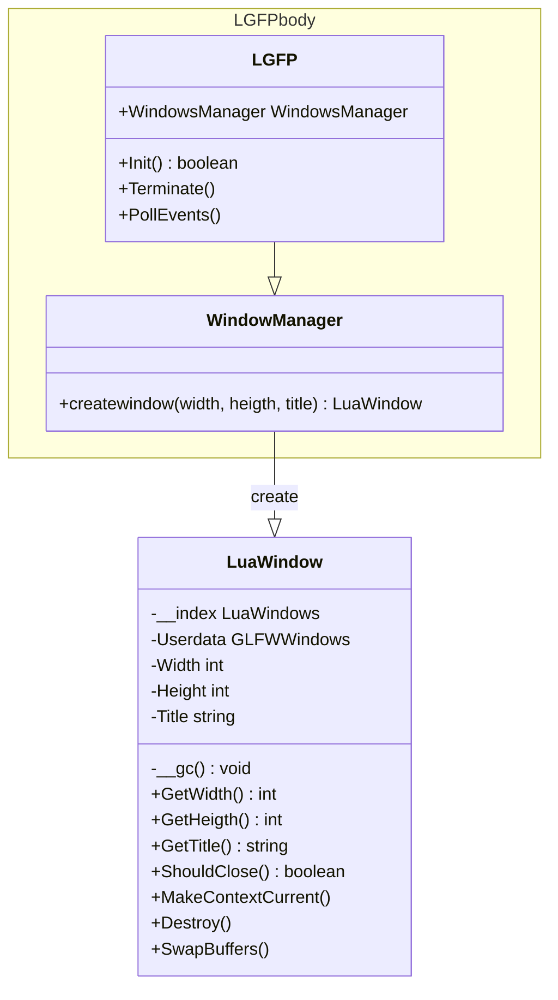

# overview

```mermaid
    classDiagram

    class LuaWindow{
        -__index LuaWindows
        -Userdata GLFWWindows
        -Width int
        -Height int
        -Title string
        -__gc() void
        +GetWidth() int
        +GetHeigth() int
        +GetTitle() string
        +ShouldClose() boolean
        +MakeContextCurrent()
        +Destroy()
        +SwapBuffers()
    }
    
    namespace LGFP body{
        class WindowManager{
            +createwindow(width, heigth, title) LuaWindow
        }

        class LGFP{
            +WindowsManager WindowsManager

            +Init() boolean
            +Terminate()
            +PollEvents()
        }
    }

    LGFP --|> WindowManager
    WindowManager --|> LuaWindow: create


```
